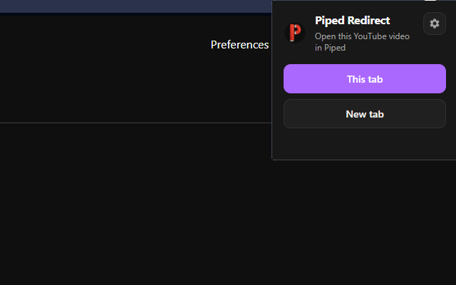
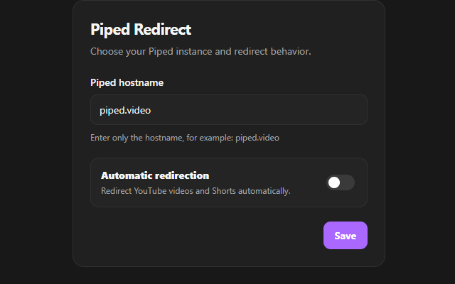

# Piped Redirect Extension

<p align="center">
  
</p>

<p align="center">
  <a href="https://chrome.google.com/webstore/detail/emocodejgchikhkgbjcegplgnoapgfgb">
    
  </a>
  <a href="https://addons.mozilla.org/en-US/firefox/addon/pipedredirectjanigma/">
    
  </a>
  
  
</p>

Piped Redirect redirects supported YouTube video and Shorts links to a configurable [Piped](https://github.com/TeamPiped/Piped) instance.

You can redirect links in three ways:

- Automatically when opening supported YouTube videos or Shorts
- From the extension popup
- From the right-click context menu on YouTube links

This repository contains builds for Chromium-based browsers and Firefox.

The idea came from wanting to keep using the YouTube recommendation algorithm while opening videos through a Piped instance.

## Install

### Chrome / Chromium / Opera

[Install from Chrome Web Store](https://chrome.google.com/webstore/detail/emocodejgchikhkgbjcegplgnoapgfgb)

### Firefox

[Install from Firefox Add-ons](https://addons.mozilla.org/en-US/firefox/addon/pipedredirectjanigma/)

## Screenshots

### Popup



### Settings



## Features

- Redirect supported YouTube videos to a Piped instance.
- Redirect supported YouTube Shorts to a Piped instance.
- Open the current YouTube video in Piped from the extension popup.
- Open the current YouTube video in the same tab or a new tab.
- Right-click a supported YouTube link and open it in Piped.
- Configure your preferred Piped hostname.
- Enable or disable automatic redirection.
- Supports common YouTube hosts such as:
  - `www.youtube.com`
  - `youtube.com`
  - `m.youtube.com`
  - `music.youtube.com`
  - `youtu.be`

## Supported Redirects

The extension redirects video and Shorts URLs only.

Examples:

```txt
https://www.youtube.com/watch?v=VIDEO_ID
https://youtube.com/watch?v=VIDEO_ID
https://m.youtube.com/watch?v=VIDEO_ID
https://music.youtube.com/watch?v=VIDEO_ID
https://youtu.be/VIDEO_ID
https://www.youtube.com/shorts/SHORT_ID
```

Unsupported pages such as the YouTube homepage, search results, channels, and playlists are not redirected automatically.

## Configuration

1. Click the extension icon in the toolbar.

2. Click the settings icon.

3. Enter your preferred Piped hostname.

   Example:

   ```txt
   piped.video
   ```

4. Enable or disable automatic redirection.

5. Click **Save**.

The default Piped instance is:

```txt
piped.video
```

# Temporary Development Installation

Use this when testing local builds from this repository.

## Chrome / Chromium / Opera
- Clone or download this repository.
- Build the extension.
- Open chrome://extensions/.
- Enable Developer mode.
- Click Load unpacked.

Select the built Chrome folder, for example:
```
build/chrome
```
Do not select only src/chrome, because the built extension also needs the shared common files.

## Firefox
- Clone or download this repository.
- Build the extension.
- Open about:debugging#/runtime/this-firefox.
- Click Load Temporary Add-on....

Select:
```
build/firefox/manifest.json
```
Temporary Firefox add-ons are removed when Firefox is restarted. For permanent installation in normal Firefox, the extension must be signed by Mozilla.

## How to build

1. Install node and npm
2. Execute `npm install` to install packages
3. Execute `node build.js` to produce chrome and firefox extensions as zip, then import

## TODOs

- When opening a YouTube video in the same window, the page does not automatically get redirected.

## Build

Install dependencies:

```bash
npm install
```

Build the Chrome and Firefox packages:

```bash
node build.js
```

The build output should look like this:

```txt
build/
  chrome.zip
  firefox.zip
```

## Privacy

Piped Redirect stores only the following settings using browser storage:

* Piped hostname
* Automatic redirection preference

The extension does not collect, sell, transmit, or share personal data.

The extension reads the active tab URL only when needed to determine whether the current page is a supported YouTube video or Shorts URL.

## Permissions

The extension uses the following permissions:

| Permission     | Reason                                                               |
| -------------- | -------------------------------------------------------------------- |
| `storage`      | Saves the selected Piped hostname and automatic redirect preference. |
| `activeTab`    | Reads the current tab URL when using the popup redirect buttons.     |
| `contextMenus` | Adds the right-click “Open link in Piped” menu item.                 |

## License

This project is open source and available under the [MIT License](LICENSE).